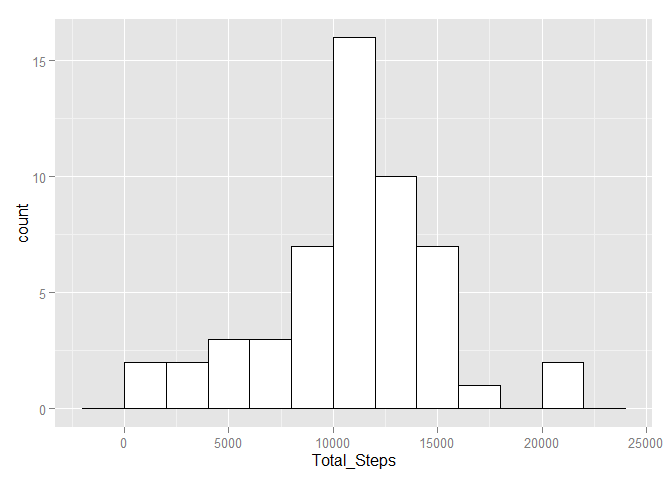
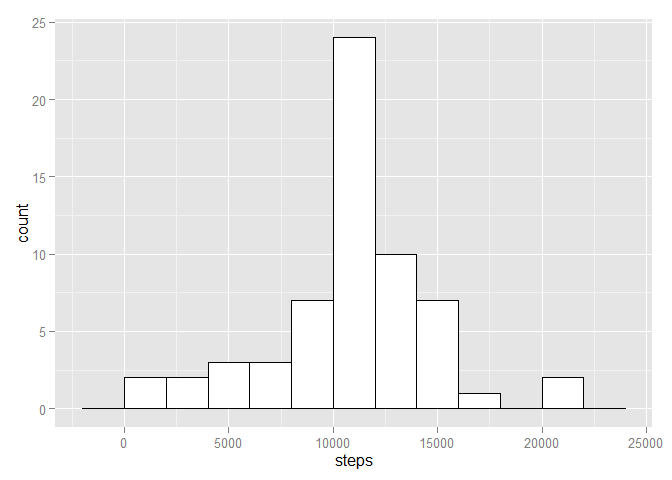
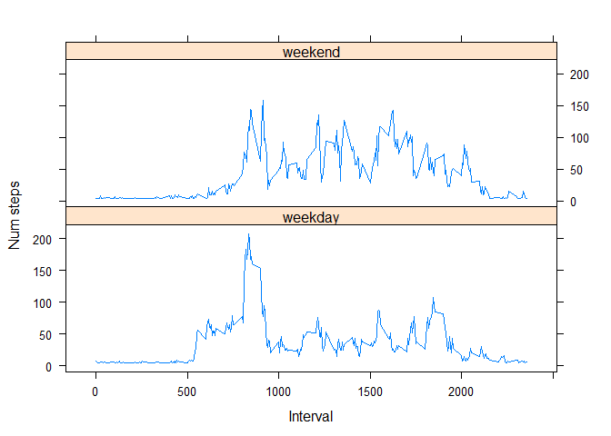

# Reproducible Research: Peer Assessment 1


## Loading and preprocessing the data
#### 1 - Load the data (i.e. read.csv())

```r
rawdata <- read.csv("./rawdata//activity.csv") #read in data, assuming its already unzipped.
data <- rawdata
```

#### 2 - Process/transform the data (if necessary) into a format suitable for your analysis

```r
data$date <- as.POSIXct(rawdata$date) #convert date format
head(data) #check formatting
```

```
##   steps       date interval
## 1    NA 2012-10-01        0
## 2    NA 2012-10-01        5
## 3    NA 2012-10-01       10
## 4    NA 2012-10-01       15
## 5    NA 2012-10-01       20
## 6    NA 2012-10-01       25
```


## What is mean total number of steps taken per day?

#### 1 - Make a histogram of the total number of steps taken each day

```r
library(ggplot2) #load ggplot for historgrams
```

```
## Warning: package 'ggplot2' was built under R version 3.1.2
```

```r
plotme1 = na.omit(aggregate(data$steps, list(data[,"date"]), "sum")) #aggregate the totals per day, omit NAS
colnames(plotme1) <- c("Dates", "Total_Steps")

#make histogram of the step frequency
ggplot(plotme1, aes(x=Total_Steps)) +
    geom_histogram(binwidth=2000, colour="black", fill="white")
```

 

#### 2 - Calculate and report the mean and median total number of steps taken per day

```r
mean(plotme1$Total_Steps) # mean of the daily step totals
```

```
## [1] 10766.19
```

```r
median(plotme1$Total_Steps) # median of the daily step totals
```

```
## [1] 10765
```

## What is the average daily activity pattern?
#### 1 - Make a time series plot (i.e. type = "l") of the 5-minute interval (x-axis) and the average number of steps taken, averaged across all days (y-axis)

```r
plotme2 = aggregate(steps ~ interval, data=na.omit(data), FUN=mean) #get steps by interval, omit NAs
ggplot(plotme2, aes(x=interval, y=steps)) +
  geom_line(stat="identity")
```

 

```r
intervalMeans <- plotme2 #store for later use
```

#### 2 - Which 5-minute interval, on average across all the days in the dataset, contains the maximum number of steps?

```r
intervalMeans[intervalMeans$steps==max(intervalMeans$steps),]
```

```
##     interval    steps
## 104      835 206.1698
```

## Imputing missing values

#### 1 - Calculate and report the total number of missing values in the dataset (i.e. the total number of rows with NAs)

```r
#Make a mask for which values are complete:
mask <- complete.cases(data)

#Count the values
table(mask)
```

```
## mask
## FALSE  TRUE 
##  2304 15264
```

```r
#You can see that there are 2304 missing values
```

#### 2 - Devise a strategy for filling in all of the missing values in the dataset. The strategy does not need to be sophisticated. For example, you could use the mean/median for that day, or the mean for that 5-minute interval, etc.

```r
mean(na.omit(data$steps)) #just use the mean value of steps
```

```
## [1] 37.3826
```

```r
length(data[!mask,]$steps) #as you can see we can isolate and replace the missing values, as the length of this subset matches the number of missing values
```

```
## [1] 2304
```

#### 3 - Create a new dataset that is equal to the original dataset but with the missing data filled in.

```r
#Replace missing steps values with interval means
dataPatched <- data #copy the data
dataPatched[!mask,]$steps <- mean(na.omit(data$steps)) #replace missing values with the mean steps
```

#### 4 - Make a histogram of the total number of steps taken each day and Calculate and report the mean and median total number of steps taken per day. Do these values differ from the estimates from the first part of the assignment? What is the impact of imputing missing data on the estimates of the total daily number of steps?


```r
plotme3 = aggregate(steps ~ date, data=dataPatched, FUN=sum) #get total steps by day
ggplot(plotme3, aes(x=steps)) +
    geom_histogram(binwidth=2000, colour="black", fill="white") #plot it baby woo
```

 

```r
summary(plotme3$steps) #New, patched data:
```

```
##    Min. 1st Qu.  Median    Mean 3rd Qu.    Max. 
##      41    9819   10770   10770   12810   21190
```

```r
summary(plotme1$Total_Steps) #Unpatched data:
```

```
##    Min. 1st Qu.  Median    Mean 3rd Qu.    Max. 
##      41    8841   10760   10770   13290   21190
```

## Are there differences in activity patterns between weekdays and weekends?

#### 1 - Create a new factor variable in the dataset with two levels – “weekday” and “weekend” indicating whether a given date is a weekday or weekend day.

```r
dataWeekTest <- dataPatched #use the dataset with filled in values

dataWeekTest$day <- factor(weekdays(dataWeekTest$date)) #make a day of the week factor, listing all days
#but we want a 2 level factor for Weekend and Weekday, so:
levels(dataWeekTest$day) <- c("weekday","weekday","weekend","weekend","weekday","weekday","weekday") #duplicate levels down to weekend and weekday
```

#### 2 - Make a panel plot containing a time series plot (i.e. type = "l") of the 5-minute interval (x-axis) and the average number of steps taken, averaged across all weekday days or weekend days (y-axis). See the README file in the GitHub repository to see an example of what this plot should look like using simulated data.

```r
#aggregate it!
plotme4_weekend <- plotme4 <- aggregate(dataWeekTest$steps[dataWeekTest$day=="weekend"], list(dataWeekTest[,"interval"][dataWeekTest$day=="weekend"]), "mean") 
plotme4_weekday <- plotme4 <- aggregate(dataWeekTest$steps[dataWeekTest$day=="weekday"], list(dataWeekTest[,"interval"][dataWeekTest$day=="weekday"]), "mean")

#make a panel plot
library("lattice")

colnames(plotme4_weekend) <- c("interval", "steps")
colnames(plotme4_weekday) <- c("interval", "steps")

plotme4_weekday$dayType <- "weekday" #add designators
plotme4_weekend$dayType <- "weekend"

plotme4 <- rbind(plotme4_weekday, plotme4_weekend)

xyplot(
    type="l",
    data=plotme4,
    steps ~ interval | dayType,
    xlab="Interval",
    ylab="Num steps",
    layout=c(1,2)
)
```

 

